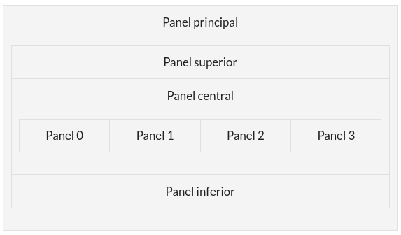

# Card Layout

Este repositorio almacenará a solución á práctica da aplicación onde se crea un JFrame con Card Layout.

## Especificacións

Crea unha aplicación Java Swing que conteña a seguinte disposición de elementos na interface:



O **panel principal** será o contedor dos paneis superior, central e inferior.

O **panel central** ten definido o layout como CardLayout e contén os 4 paneis mostrados, dos que só se mostrará un de cada vez. Cada un destes paneis ten unha etiqueta con información do panel. Podes tamén asignarlle unha cor de fondo diferente a cada un para diferencialos mellor.

Cando a aplicación se cargue debe mostrarse o panel 0.

O panel superior contén 3 botóns que estarán activados cando se carga a aplicación. Cada un destes botóns fai referencia a un panel (panel1, panel2 e panel3).

Cando se pulsa un botón (panel1, panel2 ou panel3):

* Mostrarase o panel ao que fai referencia.
* Desactivarase o botón pulsado e activaranse os outros (en caso de non estalo xa).

No **panel inferior** haberá dous botóns: un para restaurar a aplicación ao estado inicial e outra para saír.

Non se poderá saír da aplicación pulsando o botón X da ventá.

Fai que cando se lance a aplicación esta apareza centrada na pantalla.

## Explicación do repositorio

A estrutura do repositorio é a seguinte:

```bash
.
├── doc
│   └── README.md
└── README.md
└── cardLayout
    └── src
        └── cardlayout
            └── gui
```

Explicación da estrutura de ficheiros e directorios:

- `README.md` raíz: contén as instrucións da tarefa. **NON debe modificarse**.
- `doc`: aquí debes incluír calquera documentación que consideres necesaria.
- `cardLayout`: proxecto NetBeans para a codificación da práctica. Ten un JFrame inicial chamado PantallaPrincipal (non cambies o seu nome).

    Paquetes:

  - `gui`: conterá os JFrames e demáis ventás das que estará composta a aplicación.

## Documentación

Escribe a documentación en formato Markdown. Podes consultar a seguinte [Guía Markdown](https://github.com/adam-p/markdown-here/wiki/Markdown-Cheatsheet)

Enlaza todos os ficheiros necesarios usando a sintaxe Markdown

Se inclúes imaxes, colócaas no directorio doc/imaxes.

## Instrucións

### Fork

Fai un fork do repositorio orixinal e configúrao de forma privada.

Outorga permisos de developer á profesora (usuario cparis-fp) no teu repositorio.

### Clona o repositorio na túa máquina de traballo

`git clone <url do teu fork>`

### Crea a túa rama persoal de traballo ou release branch

Crea a túa propia rama de traballo.

Crea unha nova rama a partir de `master` que se chame como o teu login no curso (rb = release branch):

`git checkout -b <rb-login>`

Se o que queres é descargar a túa rama do repositorio remoto debes executar o comando:

`git checkout -b <rb-login> origin/<rb-login>`

**NOTAS**:

- Para crear a nova rama debes estar no directorio do repositorio.
- Non traballes na rama master. Podes ter máis ramas no repositorio, pero a solución será entregada na rama `rb-login`.

### Revisa se se produciron actualizacións nas especificacións

Cada vez que retomes o teu traballo, asegúrate de ter a última versión das especificacións. Para iso:

1. (Só a primeira vez). Engade como remoto o repositorio da profesora dende o que fixeches o fork.
    - `git remote add profesora <urlRepositorioProfesora>`
2. (Cada vez que retomes o traballo). Revisa as novidades e descarga as actualizacións do repositorio da profesora.
    - `git fetch profesora master`
3. (Cada vez que haxa novidades). Fusiona as novidades coa túa rama `rb-login`. Non deberían producirse conflitos.
    - Asegúrate de estar na túa rama `rb-login`: `git checkout <rb-login>`
    - Inclúe na túa rama actual as novidades: `git merge profesora/master`
4. (Cada vez que finalices a sesión de traballo). Sube a nova versión do proxecto ao repositorio.
    - `git add --all`
    - `git commit -m "mensaxe"`
    - `git push origin <rb-login>`
