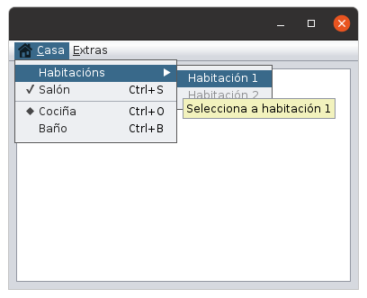
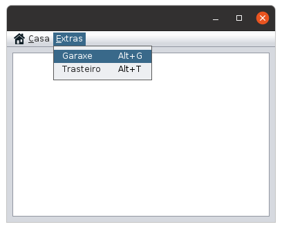
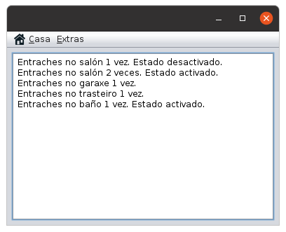

# Menú

Os menús permiten ás persoas usuarias seleccionar unha acción a realizar de entre varias.

Para incluír un menú nunha aplicación Java Swing, hai que engadir un elemento **JMenuBar**. Este **JMenuBar** conterá os elementos **JMenu**.

Tanto o **JMenu** como os **JMenuItem**, **JCheckboxMenuItem** e o **JRadioButtonMenuItem** actúan como simples botóns.

Os menús soportan dúas formas alternativas de interaccionar con eles a través do teclado: *mnemonics* e *accelerators*.

* **Mnemonics**: ofrecen unha forma de usar o teclado para navegar pola xerarquía do menú, incrementando a accesibilidade dos programas. Para acceder ao menú usarase a combinación de teclas Alt+carácter. O mnemonic amósase subliñando o carácter seleccionado no texto do menú. Ver o exemplo do menú "Casa" máis abaixo.
* **Acelerators**: obrecen atallos de teclado para acceder de forma rápida a unha acción do menú. Permite executar unha acción do menú aínda que non estea visible.

*Mnemonics are for all users; accelerators are for power users.*

## Especificacións

Crea unha aplicación Java Swing que conteña o menú coma os das seguintes imaxes:




Descrición dos menús:

* Casa terá unha icona dunha casa.
  * Habitacións (JMenu)
    * Habitación 1 (JMenuItem). Engadir TooltipText.
    * Habitación 2 (JMenuItem): desactivado
  * Salón (JCheckBoxMenuItem): seleccionado. Ctrl+S.
  * Separador (JSeparator)
  * Cociña (JRadioButtonMenuItem): seleccionado. Ctrl+O
  * Baño (JRadioButtonMenuItem): Ctrl+B
* Extras:
  * Garaxe (JMenuItem): Alt+G
  * Trasteiro (JMenuItem): Alt+T

Programar os mnemonics e acelerators das opcións do menú.

Ademais, o JFrame inclúe un **JTextPane**, no que se incluirán a modo de log ou rexistro as opcións seleccionadas pola persoa usuaria escribindo unha mensaxe do tipo:

"Entraches no salón 3 veces. Estado desactivado." O estado fai referencia a se o RadioButton ou Checkbox queda seleccionado ou non. O número de veces é un contador que se vai incrementando a medida que se pulsan as opcións.



Establece nomes de variables significativos.

## Explicación do repositorio

A estrutura do repositorio é a seguinte:

```bash
.
├── doc
│   └── README.md
├── img
├── README.md
└── menu
    └── src
        └── menu
            ├── gui
            └── imaxes
```

Explicación da estrutura de ficheiros e directorios:

* `doc`: aquí debes incluír calquera documentación que consideres necesaria.
* `img`: contén as imaxes necesarias da documentación.
* `README.md` raíz: contén as instrucións da tarefa. **NON debe modificarse**.
* `menu`: proxecto NetBeans para a codificación da práctica. Ten un JFrame inicial chamado PantallaPrincipal (non cambies o seu nome).

  Paquetes:

  * `gui`: conterá os JFrames e demáis ventás das que estará composta a aplicación.
  * `imaxes`: conterá as imaxes.

## Documentación

Escribe a documentación en formato Markdown. Podes consultar a seguinte [Guía Markdown](https://github.com/adam-p/markdown-here/wiki/Markdown-Cheatsheet)

Enlaza todos os ficheiros necesarios usando a sintaxe Markdown

Se inclúes imaxes, colócaas no directorio doc/imaxes.

## Instrucións

### Fork

Fai un fork do repositorio orixinal e configúrao de forma privada.

Outorga permisos de developer á profesora (usuario cparis-fp) no teu repositorio.

### Clona o repositorio na túa máquina de traballo

`git clone <url do teu fork>`

### Crea a túa rama persoal de traballo ou release branch

Crea a túa propia rama de traballo.

Crea unha nova rama a partir de `master` que se chame como o teu login no curso (rb = release branch):

`git checkout -b <rb-login>`

Se o que queres é descargar a túa rama do repositorio remoto debes executar o comando:

`git checkout -b <rb-login> origin/<rb-login>`

**NOTAS**:

* Para crear a nova rama debes estar no directorio do repositorio.
* Non traballes na rama master. Podes ter máis ramas no repositorio, pero a solución será entregada na rama `rb-login`.

### Revisa se se produciron actualizacións nas especificacións

Cada vez que retomes o teu traballo, asegúrate de ter a última versión das especificacións. Para iso:

1. (Só a primeira vez). Engade como remoto o repositorio da profesora dende o que fixeches o fork.
    * `git remote add profesora <urlRepositorioProfesora>`
2. (Cada vez que retomes o traballo). Revisa as novidades e descarga as actualizacións do repositorio da profesora.
    * `git fetch profesora master`
3. (Cada vez que haxa novidades). Fusiona as novidades coa túa rama `rb-login`. Non deberían producirse conflitos.
    * Asegúrate de estar na túa rama `rb-login`: `git checkout <rb-login>`
    * Inclúe na túa rama actual as novidades: `git merge profesora/master`
4. (Cada vez que finalices a sesión de traballo). Sube a nova versión do proxecto ao repositorio.
    * `git add --all`
    * `git commit -m "mensaxe"`
    * `git push origin <rb-login>`
